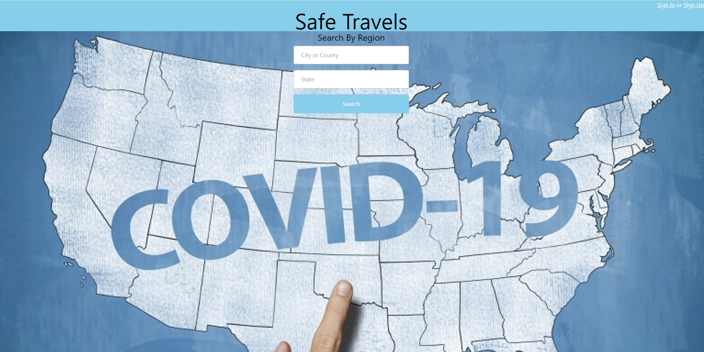
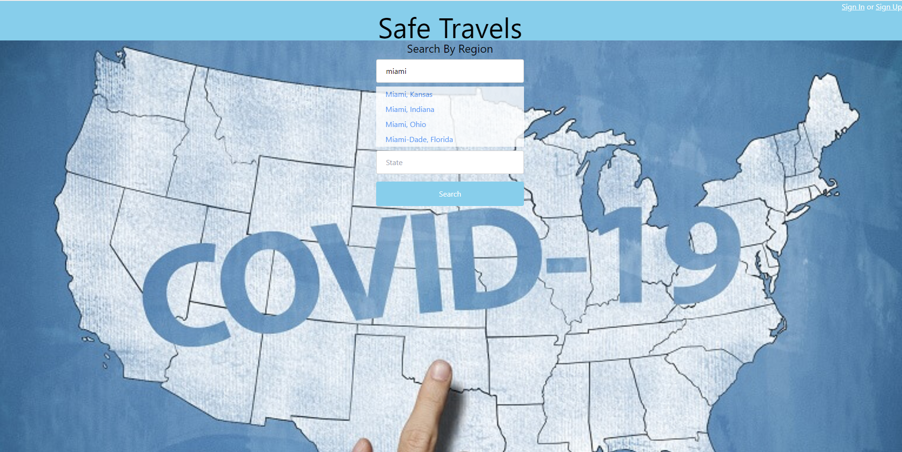
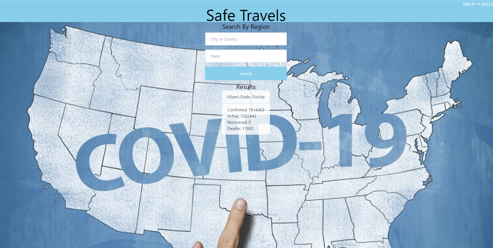
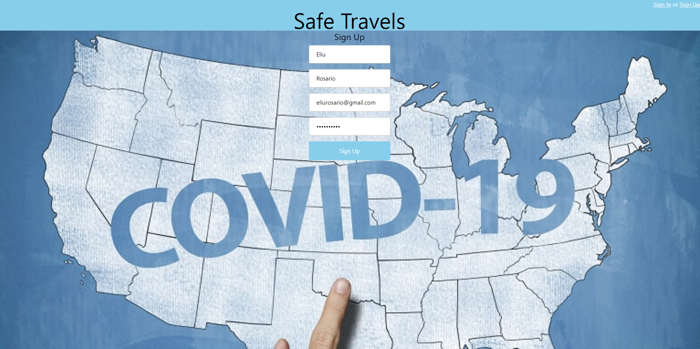

# Safe Travels
## Description
A simple app that displays a city or county’s recent COVID stats.

To see it live, see [Safe Travels](https://safe-travels.herokuapp.com/).

## Table of Contents
- [Features](#features)
- [Contribute](#contribute)
- [Credits](#credits)
- [License](#license)
- [Questions](#questions)

## Features
- Users search for COVID data (confirmed, active, and recovered cases, and deaths) by region in the United States (city/county and state).
- As the user types, the available city/county and state is suggested with autocomplete.
- Users can sign up and favorite regions for future searches.

## Contribute
Open a PR or send an email.

## Credits
Team Members:
- Christian
- Eliu
- Mariama

Technology:
- Tailwind CSS
- Handlebars.js
- Algolia Autocomplete
- Node.js
- Express.js
- MySQL
- JWT
- Heroku

## License
See [LICENSE (GNU GPLv3)](./LICENSE).

## Questions
Reach out with questions:

- GitHub: [github.com/areas-boot-camp-projects](https://github.com/areas-boot-camp-projects)
