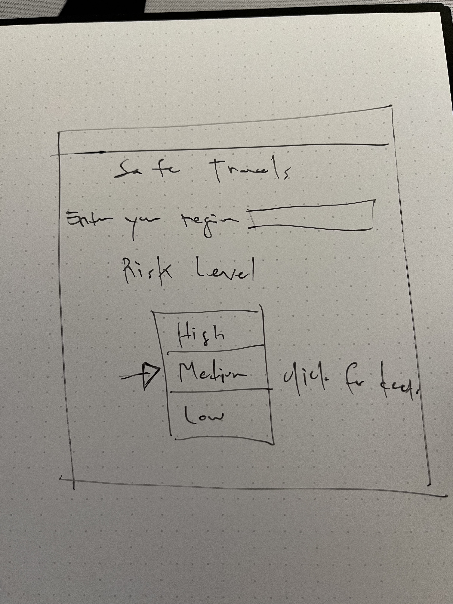

 # Proposal
 - Project name: Safe Travels
 - Team name: Safety First
 - Team members: Christian Areas, Mark Pedro, Eliu Rosario, Mariama Bah
 
 ## Description
- Users go to site to get a sense of risk to travel somewhere.
- Risk is communicated with simple tier:
	- Low Risk - Green
	- Medium Risk - Yellow
	- High Risk - Red
- See risk/stats for US, with ability to drill down to state > city/county.
- Use third-party APIs to get data (infections, hospitalizations, and deaths).
- DB will house user information, risk levels and definitions, and maybe favorites and a dashboard.
- Users must sign up to use app.
- Could have a map. Maybe use Google Maps!
- Could use email notifications.

## Tech Stack
- Tailwind CSS.
- Handlebars.js.
- Node.js and Express.js.
- MySQL.
- JWT authentication (maybe).
- Stripe for donations 😈 (*extra credit*).

## Team Interests
- Front End:
	- Mark
	- Mariama
- Back End:
	- Christian
	- E
